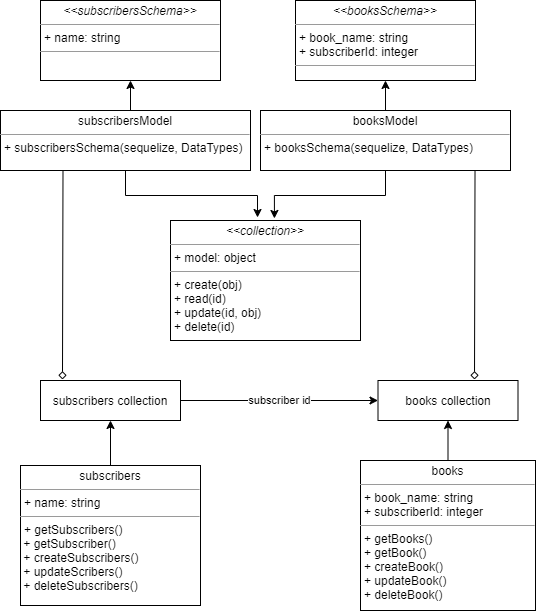

# api-server

## Description

This is a basic Express.js Api that uses PostgreSQL to manage data of two tables: Subscribers and Books.

* Subscribers table schema: { name: "//person name" }
* Books table schema: { book_name: "//book name", "subscriberId": "// The id of the subscriber who ordered this book"}

The main difference between this api and the basic one the use of a collection interface which will consume a sequelize model and perform generic database CRUD operations.

The following CRUD operations can be performed on both tables using /subscribers and /books endpoints:

* Reading all the records
* Read a specific record -> require using the record's id
* Adding a new record -> require using a body
* Updating an existing record -> require using a body and the record's id
* Deleting an existing record -> require using the record's id

## Links

Heroku deployment: https://hasnaa-api-server.herokuapp.com/
Subscribers api link: https://hasnaa-api-server.herokuapp.com/subscribers
Books api link: https://hasnaa-api-server.herokuapp.com/books
3 Pull requests where performed to generate a successfully working main branch: https://github.com/hasnaa38/api-server/pull/1, https://github.com/hasnaa38/api-server/pull/3, https://github.com/hasnaa38/api-server/pull/4

## UML

